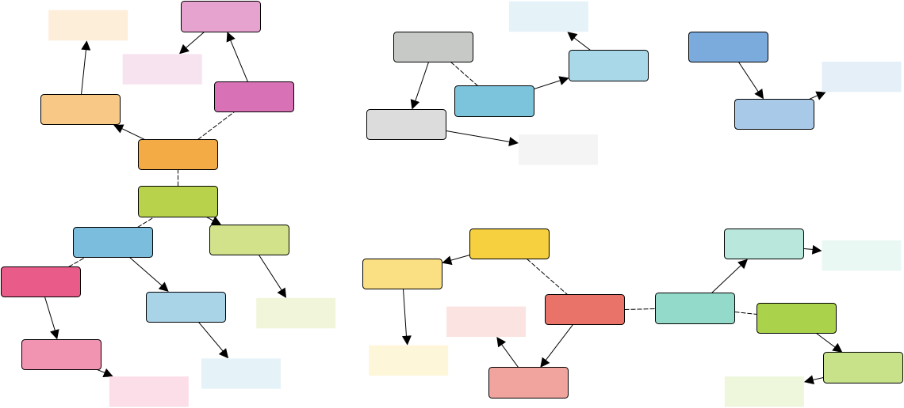

# yEd claw palette

- Get the Software: [yEd Graph Editor](https://www.yworks.com/products/yed)
- The palettes use the font Roboto Condensed. Get it at [fonts.google.com](https://fonts.google.com/specimen/Roboto+Condensed) or [github.com](https://github.com/googlefonts/roboto)

## Add palettes

- Click on Edit
- Click on Manage Palette...
- Click on Import Section...
- Select *.yed.graphml

## Beautify graph

- Click on Tools
- Click on Fit Node to Label
- Set Horizontal Space: 10
- Set Vertical Space: 4
- Play around with the Layout menue item

## Export

- Click on File
- Click on Export...
- Select your favourite format (SVG, PDF, PNG, ...)
- Set Margin: 3 (for instance, use at least 1)
- Set Scaling Factor: 0.8 (to match 16 pt; 20 pt * 0.8 = 16 pt)